  <a href="https://github.com/shivamsingh163248">
    <!--  -->
  </a>

<h2 align="center">Hi, I'm Shivam Singh! 👋</h2>

  <b>Welcome to my GitHub profile!</b> 
  🚀 Passionate about coding, open source, and building cool projects. 
  🌱 Currently learning and exploring new technologies.

  
  
  

  

  
  
  
  
  
  

